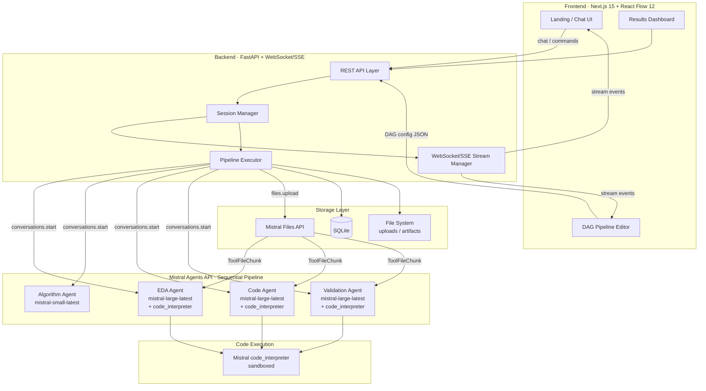
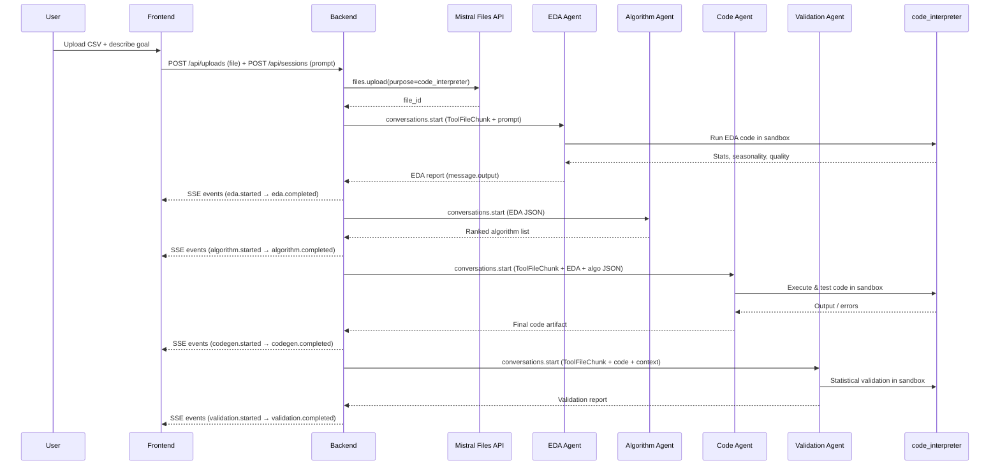

# Anomalistral — Comprehensive Implementation Plan

> Autonomous Agentic MLOps Platform for Time-Series Anomaly Detection
> Mistral Hackathon 2026 · 48h · Feb 28 – Mar 1

---

## 1. Vision & Value Proposition

Anomalistral is an **"intent-to-running-service"** platform. A user describes their anomaly detection need in natural language, and the system autonomously:

1. Ingests and validates the data
2. Performs EDA (seasonality, trend, stationarity, missing values)
3. Selects optimal algorithms based on data characteristics
4. Generates production-ready Python code
5. Validates results with statistical rigor
6. Deploys a monitoring dashboard — all without requiring ML expertise

**Key differentiator**: No competitor offers the full chain of multi-agent orchestration + visual DAG editing + code artifact generation + one-click deployment in a single product.

---

## 2. Architecture Overview



### Data Flow (Happy Path)



---

## 3. Technology Stack

### 3.1 Backend

| Component | Technology | Justification |
|-----------|-----------|---------------|
| **Framework** | FastAPI 0.115+ | Async-native, WebSocket/SSE support, auto OpenAPI docs, Pydantic v2 validation |
| **Agent Orchestration** | Mistral Agents API (beta) | Native handoffs, conversations, built-in tools (code_interpreter, web_search), server-managed state — no LangGraph overhead |
| **Code Execution** | Mistral `code_interpreter` | Zero infrastructure, sandboxed, returns stdout/stderr/files — sufficient for hackathon |
| **Data Validation** | Pandera 0.20+ | Lightweight, code-first DataFrame schemas, 10x simpler than Great Expectations |
| **ML Libraries** | PyOD 2.0, scikit-learn, statsmodels, Prophet | Covers all 5 MVP algorithms (STL, IsolationForest, ECOD, Prophet, Autoencoder) |
| **Database** | SQLite (aiosqlite) | Zero provisioning, single-file, sufficient for single-user demo, JSON stored as TEXT |
| **Streaming** | SSE (sse-starlette) | One-way server→client streaming (simpler than WebSocket), HTTP POST for client→server commands |

### 3.2 Frontend

| Component | Technology | Justification |
|-----------|-----------|---------------|
| **Framework** | Next.js 15 (App Router) | SSR/SSG, API routes for BFF pattern, excellent DX |
| **DAG Editor** | React Flow 12 (@xyflow/react) | Custom nodes/edges, DnD, serialization, SSR-compatible |
| **State Management** | Zustand | Minimal boilerplate, React Flow uses it internally |
| **UI Components** | shadcn/ui + Tailwind CSS 4 | Beautiful defaults, fully customizable, accessible |
| **SSE Client** | @microsoft/fetch-event-source | Robust reconnection, POST method support |
| **Charts** | Recharts or Plotly.js | Time-series visualization for EDA results and anomaly overlay |

### 3.3 Mistral Models Assignment (Actual Implementation)

| Agent | Model | Why |
|-------|-------|-----|
| EDA | `mistral-large-latest` | Data understanding requires strong reasoning + code_interpreter |
| Algorithm Selection | `mistral-small-latest` | Structured recommendation task, cheaper |
| Code Generation | `mistral-large-latest` | `codestral-latest` does NOT support code_interpreter; must use large + code_interpreter |
| Validation | `mistral-large-latest` | Statistical validation requires strong reasoning + code_interpreter |

> **Budget note**: €15/month cap, 6 req/sec. Strategy: Use `mistral-small-latest` for the algorithm agent (no code_interpreter needed), `mistral-large-latest` for all agents requiring code_interpreter execution.
>
> **Key discovery**: `codestral-latest` and `devstral-latest` do NOT support the `code_interpreter` builtin connector. All agents needing sandbox execution must use `mistral-large-latest`.

### 3.4 Deployment

| Component | Platform | Notes |
|-----------|----------|-------|
| **Backend (FastAPI)** | Railway | One-click deploy, built-in SQLite persistence (volume mount), env var management |
| **Frontend (Next.js)** | Vercel | Free tier, instant deploys, edge network |
| **Alternative (all-in-one)** | Render | Free tier for demo, Docker support, persistent disk |

---

## 4. Agent Architecture (Detailed)

### 4.1 Agent Creation Pattern (Actual Implementation)

Agents are created via `AgentRegistry` with double-checked locking and cached per process. No handoffs are configured — the pipeline executor calls each agent independently.

```python
eda_agent = client.beta.agents.create(
    model="mistral-large-latest",
    name="anomalistral_eda",
    description="Performs exploratory data analysis for time-series datasets",
    instructions=EDA_PROMPT,
    tools=[{"type": "code_interpreter"}],
)

algorithm_agent = client.beta.agents.create(
    model="mistral-small-latest",
    name="anomalistral_algorithm",
    description="Recommends suitable anomaly detection algorithms",
    instructions=ALGORITHM_PROMPT,
    tools=[],
)

code_agent = client.beta.agents.create(
    model="mistral-large-latest",
    name="anomalistral_codegen",
    description="Generates and tests anomaly detection pipeline code",
    instructions=CODEGEN_PROMPT,
    tools=[{"type": "code_interpreter"}],
)

validation_agent = client.beta.agents.create(
    model="mistral-large-latest",
    name="anomalistral_validation",
    description="Validates anomaly detection outputs and statistical reliability",
    instructions=VALIDATION_PROMPT,
    tools=[{"type": "code_interpreter"}],
)
```

### 4.2 Sequential Pipeline Execution (Actual Implementation)

Server-side handoffs (`handoff_execution="server"`) were **disabled** due to instability (HTTP 500 / code 3000). The pipeline executor runs each agent phase as an independent `conversations.start` call with dataset files uploaded via the Mistral Files API.

```python
file_id = client.files.upload(
    file={"file_name": path.name, "content": fh},
    purpose="code_interpreter",
)

inputs = [MessageInputEntry(
    role="user",
    content=[
        ToolFileChunk(tool="code_interpreter", file_id=file_id),
        TextChunk(text=prompt),
    ],
)]

response = client.beta.conversations.start(
    agent_id=eda_agent.id,
    inputs=inputs,
)

for output in response.outputs:
    if output.type == "message.output":
        # Extract text content from the agent's response
        pass
    elif output.type == "tool.execution":
        # code_interpreter ran and returned results
        pass
```

**Key discoveries:**
- `agents.complete()` does NOT execute code_interpreter — only returns tool_call intent
- `conversations.start()` automatically executes code_interpreter and returns results
- `client.files.upload()` requires `purpose="code_interpreter"` for CSV files (422 without it)
- `ToolFileChunk` goes inside `MessageInputEntry.content` as a content chunk

### 4.3 Self-Debugging

Self-debugging within a single `conversations.start` call is handled natively by the code_interpreter — if code fails, the agent sees the error and can retry within the same conversation turn. Explicit multi-turn retry loops via `conversations.append` are available but not currently used in the pipeline.

---

## 5. Backend Architecture

### 5.1 Project Structure

```
backend/
├── app/
│   ├── __init__.py
│   ├── main.py                  # FastAPI app, lifespan, middleware
│   ├── config.py                # Settings via pydantic-settings + .env
│   ├── deps.py                  # Dependency injection (db, mistral client)
│   ├── models/
│   │   ├── __init__.py
│   │   ├── database.py          # SQLAlchemy/SQLModel models
│   │   └── schemas.py           # Pydantic request/response schemas
│   ├── routers/
│   │   ├── __init__.py
│   │   ├── sessions.py          # POST /sessions, GET /sessions/:id
│   │   ├── pipelines.py         # POST /pipelines, PUT /pipelines/:id/dag
│   │   ├── stream.py            # GET /stream/:session_id (SSE)
│   │   └── uploads.py           # POST /uploads (file upload)
│   ├── agents/
│   │   ├── __init__.py
│   │   ├── registry.py          # Agent creation & caching
│   │   ├── executor.py          # Sequential pipeline executor + Mistral Files API
│   │   └── prompts/
│   │       ├── orchestrator.py
│   │       ├── eda.py
│   │       ├── algorithm.py
│   │       ├── codegen.py
│   │       └── validation.py
│   ├── services/
│   │   ├── __init__.py
│   │   ├── streaming.py         # SSE event manager
│   │   ├── file_handler.py      # Upload processing
│   │   └── retry.py             # Exponential backoff for Mistral API calls
│   └── db/
│       ├── __init__.py
│       └── session.py           # async SQLite session factory
├── uploads/                     # User-uploaded datasets
├── artifacts/                   # Generated code, reports
├── requirements.txt
├── Dockerfile
└── .env.example
```

### 5.2 Core API Endpoints

| Method | Path | Purpose |
|--------|------|---------|
| `POST` | `/api/sessions` | Create new anomaly detection session (upload file + prompt) |
| `GET` | `/api/sessions/:id` | Get session status, results, artifacts |
| `GET` | `/api/stream/:session_id` | SSE stream for real-time agent events |
| `POST` | `/api/sessions/:id/command` | Send user commands (approve, modify, cancel) |
| `PUT` | `/api/sessions/:id/dag` | Update pipeline DAG configuration |
| `GET` | `/api/sessions/:id/artifacts` | Download generated code / reports |
| `POST` | `/api/uploads` | Upload dataset file |

### 5.3 SSE Event Envelope

```json
{
  "v": 1,
  "session_id": "sess_abc123",
  "seq": 42,
  "ts": "2026-02-28T14:30:00Z",
  "type": "status | delta | tool_call | tool_result | code_stdout | validation | error | dag_update",
  "payload": {}
}
```

### 5.4 Database Schema (SQLite)

```sql
CREATE TABLE sessions (
    id TEXT PRIMARY KEY,
    created_at TIMESTAMP DEFAULT CURRENT_TIMESTAMP,
    status TEXT DEFAULT 'created',
    user_prompt TEXT,
    dataset_path TEXT,
    conversation_id TEXT,
    dag_config TEXT,
    eda_results TEXT,
    algorithm_recommendations TEXT,
    generated_code TEXT,
    validation_results TEXT
);

CREATE TABLE events (
    id INTEGER PRIMARY KEY AUTOINCREMENT,
    session_id TEXT REFERENCES sessions(id),
    seq INTEGER,
    event_type TEXT,
    payload TEXT,
    created_at TIMESTAMP DEFAULT CURRENT_TIMESTAMP
);
```

---

## 6. Frontend Architecture

### 6.1 Project Structure

```
frontend/
├── src/
│   ├── app/
│   │   ├── layout.tsx
│   │   ├── page.tsx              # Landing / session start
│   │   ├── session/
│   │   │   └── [id]/
│   │   │       ├── page.tsx      # Main session view
│   │   │       └── layout.tsx
│   │   └── globals.css
│   ├── components/
│   │   ├── ui/                   # shadcn/ui components
│   │   ├── chat/
│   │   │   ├── ChatPanel.tsx     # Chat input + message list
│   │   │   └── MessageBubble.tsx
│   │   ├── pipeline/
│   │   │   ├── PipelineEditor.tsx    # React Flow wrapper
│   │   │   ├── PipelineNode.tsx      # Custom node (status-aware)
│   │   │   ├── FlowEdge.tsx          # Animated edge
│   │   │   ├── NodePalette.tsx       # DnD sidebar
│   │   │   └── PipelineToolbar.tsx
│   │   ├── results/
│   │   │   ├── EDAReport.tsx
│   │   │   ├── AnomalyChart.tsx
│   │   │   ├── ValidationReport.tsx
│   │   │   └── CodeViewer.tsx
│   │   └── layout/
│   │       ├── Header.tsx
│   │       ├── Sidebar.tsx
│   │       └── StatusBar.tsx
│   ├── stores/
│   │   ├── sessionStore.ts       # Zustand: session state
│   │   ├── pipelineStore.ts      # Zustand: nodes, edges, status
│   │   └── streamStore.ts        # Zustand: SSE events
│   ├── hooks/
│   │   ├── useSSE.ts             # SSE connection hook
│   │   └── useSession.ts         # Session CRUD hook
│   ├── lib/
│   │   ├── api.ts                # API client (fetch wrapper)
│   │   └── utils.ts
│   └── types/
│       └── index.ts              # Shared TypeScript types
├── public/
├── next.config.ts
├── tailwind.config.ts
├── tsconfig.json
└── package.json
```

### 6.2 React Flow DAG Editor

Each pipeline step is a custom node with:
- **Status indicator**: idle (gray) → running (blue pulse) → success (green) → error (red)
- **Step type icon**: data upload, EDA, algorithm, code gen, validation, deploy
- **Expand/collapse**: click to see details, code snippets, metrics

Nodes are connected by animated edges showing data flow direction.

```
┌──────────┐    ┌──────────┐    ┌──────────┐    ┌──────────┐    ┌──────────┐
│  Upload  │───▶│   EDA    │───▶│Algorithm │───▶│ Code Gen │───▶│Validation│
│  📁 ✅   │    │  📊 🔄   │    │  🧠 ⏳   │    │  💻 ⏳   │    │  ✓  ⏳   │
└──────────┘    └──────────┘    └──────────┘    └──────────┘    └──────────┘
```

### 6.3 Session View Layout

```
┌─────────────────────────────────────────────────────┐
│  Header: Anomalistral · Session #abc123             │
├──────────┬──────────────────────────────────────────┤
│          │                                          │
│  Sidebar │     Main Content Area                    │
│          │     ┌────────────────────────────────┐   │
│  • Chat  │     │  Pipeline DAG Editor            │   │
│  • DAG   │     │  (React Flow canvas)            │   │
│  • EDA   │     └────────────────────────────────┘   │
│  • Code  │     ┌────────────────────────────────┐   │
│  • Results│     │  Detail Panel                   │   │
│          │     │  (EDA / Code / Validation view)  │   │
│          │     └────────────────────────────────┘   │
├──────────┴──────────────────────────────────────────┤
│  Status Bar: Agent: eda-agent 🔄 │ Step 2/5 │ ...  │
└─────────────────────────────────────────────────────┘
```

---

## 7. Anomaly Detection Algorithms (MVP)

### Tier 1 — Always Available (5 core algorithms)

| # | Algorithm | Library | Best For | Complexity |
|---|-----------|---------|----------|------------|
| 1 | **STL Decomposition + MAD/z-score** | statsmodels | Seasonal univariate TS | Low |
| 2 | **Isolation Forest** | scikit-learn / PyOD | Tabular features from TS windows | Low |
| 3 | **ECOD** | PyOD | Parameter-light, multivariate | Low |
| 4 | **Prophet Forecast Intervals** | Prophet | Seasonal with trend changes | Medium |
| 5 | **Dense Autoencoder** | PyTorch / sklearn | Complex patterns, multivariate | Medium |

### Algorithm Selection Heuristics (for the Algorithm Agent)

```
IF univariate AND strong_seasonality → STL + MAD, Prophet
IF univariate AND no_seasonality → Isolation Forest on rolling features, ECOD
IF multivariate → ECOD, Isolation Forest
IF data_size > 100k → Avoid Prophet (slow), prefer STL + IsolationForest
IF pattern_complexity = high → Autoencoder
DEFAULT → Ensemble of STL + Isolation Forest (robust baseline)
```

---

## 8. MVP Scope (48-Hour Hackathon)

### MUST HAVE (Demo-critical)

1. **File upload** → CSV ingestion with basic validation (Pandera)
2. **EDA Agent** → Automated time-series analysis (seasonality, trend, missing values, basic stats)
3. **Algorithm Selection Agent** → Recommends top 2-3 algorithms based on EDA
4. **Code Generation Agent** → Produces runnable Python script using selected algorithms
5. **Code Execution** → Run via Mistral code_interpreter, return results
6. **Validation Agent** → Basic statistical validation (precision/recall if labels exist, or residual analysis)
7. **SSE Streaming** → Real-time agent progress to frontend
8. **Pipeline DAG Visualization** → React Flow showing pipeline steps + status
9. **Chat Interface** → User can describe their problem in natural language
10. **Results Display** → Show anomaly chart overlay, code viewer, validation metrics

### NICE TO HAVE (If time permits)

- Interactive DAG editing (drag-and-drop new nodes)
- Self-debugging loop with retry visualization
- Export to GitHub PR
- PDF report generation
- Multiple dataset support in one session
- Deployment agent (Streamlit dashboard generation)

### OUT OF SCOPE (Post-hackathon)

- User authentication
- Multi-tenant
- LSTM/Transformer-based detection
- Real-time streaming data
- Kubernetes deployment

---

## 9. Implementation Roadmap

### Phase 1: Foundation (Hours 0–6)

**Backend:**
- [x] Git repo init, .gitignore, project structure
- [ ] FastAPI skeleton with health check
- [ ] Config management (pydantic-settings + .env)
- [ ] SQLite setup (aiosqlite + SQLAlchemy async)
- [ ] File upload endpoint
- [ ] SSE streaming infrastructure

**Frontend:**
- [ ] Next.js 15 project scaffold
- [ ] shadcn/ui setup + Tailwind
- [ ] Basic layout (header, sidebar, main content)
- [ ] Session creation page

### Phase 2: Agent Core (Hours 6–18)

**Backend:**
- [ ] Mistral client initialization + agent registry
- [ ] Orchestrator agent with system prompt
- [ ] EDA agent (code_interpreter for pandas/matplotlib analysis)
- [ ] Algorithm selection agent
- [ ] Code generation agent
- [ ] Session lifecycle management (create → running → complete)
- [ ] SSE event broadcasting per session

**Frontend:**
- [ ] SSE hook (useSSE)
- [ ] Chat panel (send message, display streamed responses)
- [ ] Status bar (active agent, pipeline progress)

### Phase 3: Pipeline & Visualization (Hours 18–30)

**Backend:**
- [ ] Validation agent
- [ ] Pipeline executor (orchestrate handoff sequence)
- [ ] Artifact storage (save generated code, results)
- [ ] Self-debug retry logic

**Frontend:**
- [ ] React Flow pipeline editor (read-only DAG from backend)
- [ ] Custom PipelineNode with status indicators
- [ ] Animated edges
- [ ] EDA results display (charts, statistics)
- [ ] Code viewer with syntax highlighting

### Phase 4: Polish & Demo (Hours 30–42)

- [ ] Anomaly overlay chart (original data + detected anomalies)
- [ ] Validation report display
- [ ] Error handling and user feedback
- [ ] Loading states and transitions
- [ ] Mobile-responsive adjustments
- [ ] Railway / Vercel deployment

### Phase 5: Buffer & Presentation (Hours 42–48)

- [ ] End-to-end testing with real datasets
- [ ] Demo script preparation
- [ ] README.md with screenshots
- [ ] Video recording (if required)
- [ ] Bug fixes

---

## 10. Key Design Decisions

### D1: SSE over WebSocket

SSE is one-directional (server→client) which is simpler to implement and debug. User commands go via regular HTTP POST. WebSocket adds bidirectional complexity we don't need for the MVP.

### D2: Mistral code_interpreter over E2B

Zero infrastructure, managed by Mistral, returns stdout/stderr/files. E2B adds another service to configure and monitor. For the hackathon, code_interpreter is sufficient.

### D3: SQLite over PostgreSQL

Zero provisioning, single file, no connection pooling complexity. For a single-user demo this is perfect. Can migrate to Postgres post-hackathon by swapping the async engine.

### D4: Sequential pipeline over server-side handoffs

Originally planned to use `handoff_execution="server"` for automatic multi-agent routing. In practice, server-side handoffs returned HTTP 500 / code 3000 errors. The final implementation uses **explicit sequential `conversations.start` calls** per phase, which proved more reliable and gave better control over SSE event emission and error handling per phase.

### D5: Zustand over Redux/Context

React Flow uses Zustand internally. Using the same state library reduces bundle size and mental overhead. Zustand stores are simple, performant, and require minimal boilerplate.

### D6: No authentication for MVP

48-hour hackathon demo. Single user. No auth complexity. Add it post-hackathon if productionizing.

---

## 11. Agent System Prompts (Outline)

### Orchestrator
- You are the pipeline orchestrator for Anomalistral
- Analyze user intent, route to the appropriate specialist agent
- Track pipeline state across handoffs
- If user uploaded a file, start with EDA
- Always explain what you're doing and what comes next

### EDA Agent
- You perform exploratory data analysis on time-series datasets
- Use code_interpreter to run pandas, matplotlib, statsmodels
- Detect: seasonality (ACF/PACF), trend, stationarity (ADF test), missing values, outlier distribution, data frequency
- Return structured JSON with findings + plot images

### Algorithm Selection Agent
- Given EDA results, recommend top 3 anomaly detection algorithms
- Consider: data size, dimensionality, seasonality, labeled vs unlabeled
- Return ranked list with justification for each

### Code Generation Agent
- Generate production-ready Python code for the selected algorithms
- Use code_interpreter to test the code against the actual data
- Include: data loading, preprocessing, model fitting, anomaly scoring, thresholding, visualization
- If code fails, analyze error and fix (max 3 retries)

### Validation Agent
- Run statistical validation on detection results
- If labels available: precision, recall, F1, confusion matrix
- If no labels: residual analysis, distribution tests, visual inspection metrics
- Return structured validation report

---

## 12. Environment & Configuration

### .env file structure

```env
MISTRAL_API_KEY=rUO0UwIrNDEgjBhDDvvg2kwnrZMFAuFi
MISTRAL_DEFAULT_MODEL=mistral-large-latest
MISTRAL_CODE_MODEL=mistral-large-latest
MISTRAL_SMALL_MODEL=mistral-small-latest
DATABASE_URL=sqlite+aiosqlite:///./anomalistral.db
UPLOAD_DIR=./uploads
ARTIFACT_DIR=./artifacts
CORS_ORIGINS=http://localhost:3000
LOG_LEVEL=INFO
```

### .gitignore additions

```
build_plans/
instructions/
*.db
uploads/
artifacts/
.env
__pycache__/
.next/
node_modules/
```

---

## 13. Competitive Positioning

| Capability | AWS Lookout | Azure AD | Anodot | Datadog | PyOD | H2O | **Anomalistral** |
|------------|:---------:|:-------:|:------:|:-------:|:----:|:---:|:---------------:|
| End-to-end pipeline | ⚠️ | ⚠️ | ❌ | ❌ | ❌ | ⚠️ | ✅ |
| Time-series focused | ✅ | ✅ | ✅ | ⚠️ | ⚠️ | ⚠️ | ✅ |
| Visual DAG editor | ❌ | ❌ | ❌ | ❌ | ❌ | ❌ | ✅ |
| Multi-agent AI | ❌ | ❌ | ❌ | ❌ | ❌ | ❌ | ✅ |
| Self-debugging code | ❌ | ❌ | ❌ | ❌ | ❌ | ❌ | ✅ |
| No ML expertise needed | ⚠️ | ⚠️ | ❌ | ❌ | ❌ | ❌ | ✅ |
| Open/available | ❌ (sunset) | ❌ (retiring) | 💰 | 💰 | ✅ | 💰 | ✅ |

---

## 14. Risk Mitigation

| Risk | Impact | Mitigation |
|------|--------|------------|
| Mistral API rate limit (6 req/s) | Agent chain bottleneck | Batch requests, use small models where possible, cache results |
| €15/month budget exceeded | Service stops | Token counting middleware, prefer small models, limit demo runs |
| code_interpreter timeout/failure | Pipeline stalls | 3-retry loop, fallback to showing code without execution |
| React Flow SSR issues | Build failures | Use dynamic import with `ssr: false` for React Flow components |
| SQLite concurrent write lock | Data loss under load | Single writer pattern (asyncio queue), acceptable for single-user demo |
| Agent hallucination in code gen | Bad code output | Validation agent as safety net, code_interpreter catches runtime errors |

---

## 15. Demo Dataset Suggestions

For hackathon demo, prepare 2-3 datasets:

1. **NYC Taxi Demand** (classic TS, strong seasonality, known anomalies) — publicly available
2. **Server CPU Metrics** (synthetic or from NAB dataset) — operational monitoring use case
3. **Financial/Stock Data** (Yahoo Finance API) — trend + volatility anomalies

---

## 16. Decision Points for Kacper

### DP1: Frontend Framework
- **Option A (Recommended):** Next.js 15 + shadcn/ui — full-featured, great DX, Vercel deployment
- **Option B:** Vite + React — simpler, no SSR overhead, deploy as static on any host

### DP2: Deployment Platform
- **Option A (Recommended):** Vercel (frontend) + Railway (backend) — best DX, fast
- **Option B:** Render (both) — free tier, single platform, slightly slower deploys
- **Option C:** All on Railway — paid but unified

### DP3: Code Execution
- **Option A (Recommended):** Mistral code_interpreter only — zero setup
- **Option B:** code_interpreter + E2B fallback — more power, but another service to manage

### DP4: Streaming Protocol
- **Option A (Recommended):** SSE — simpler, sufficient for one-way streaming
- **Option B:** WebSocket — bidirectional, needed only if we want live DAG manipulation during execution

### DP5: Start building now?
- All research is complete. Ready to scaffold and implement.
