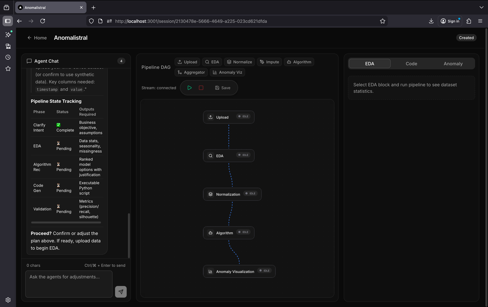
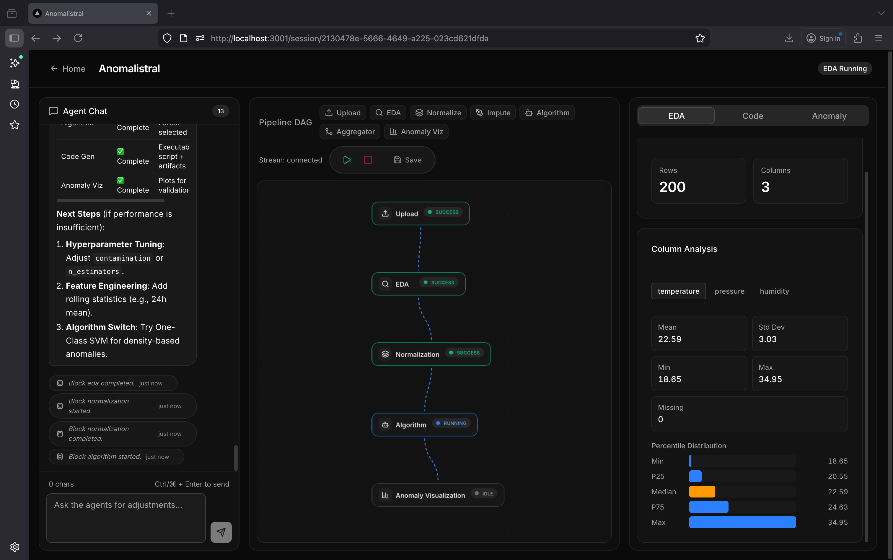
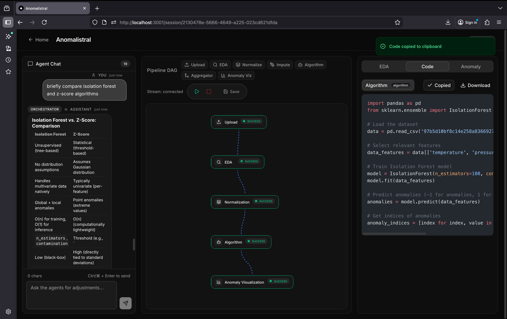
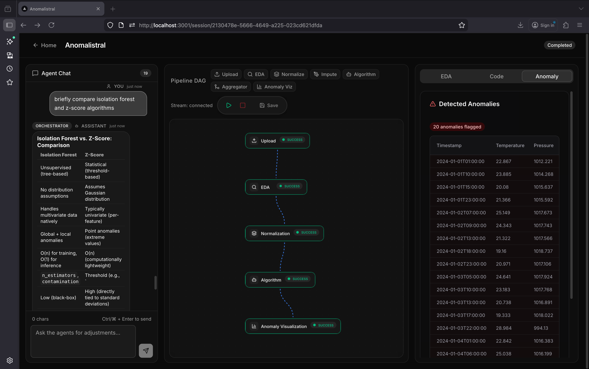
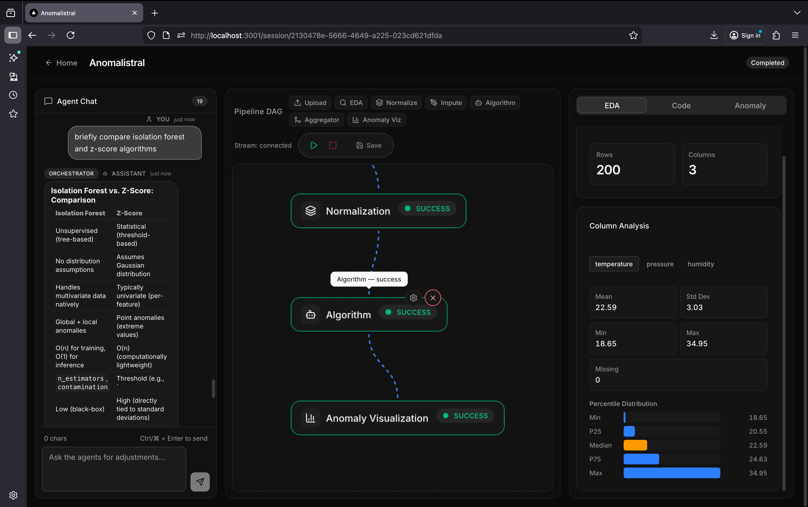
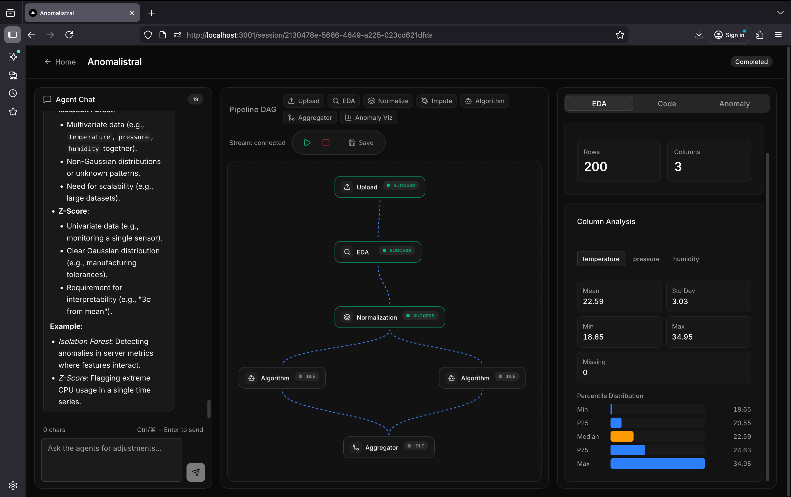
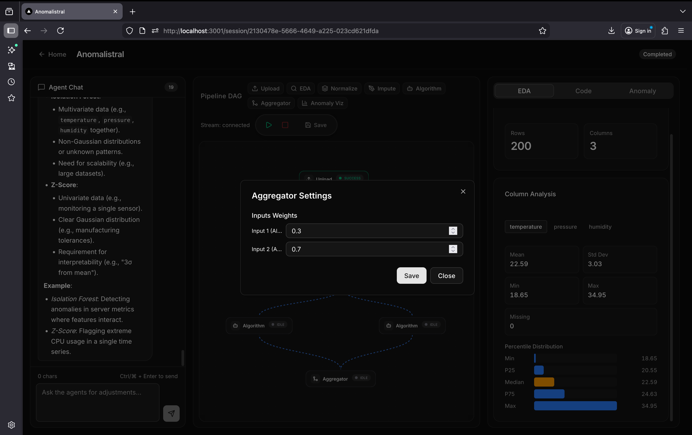
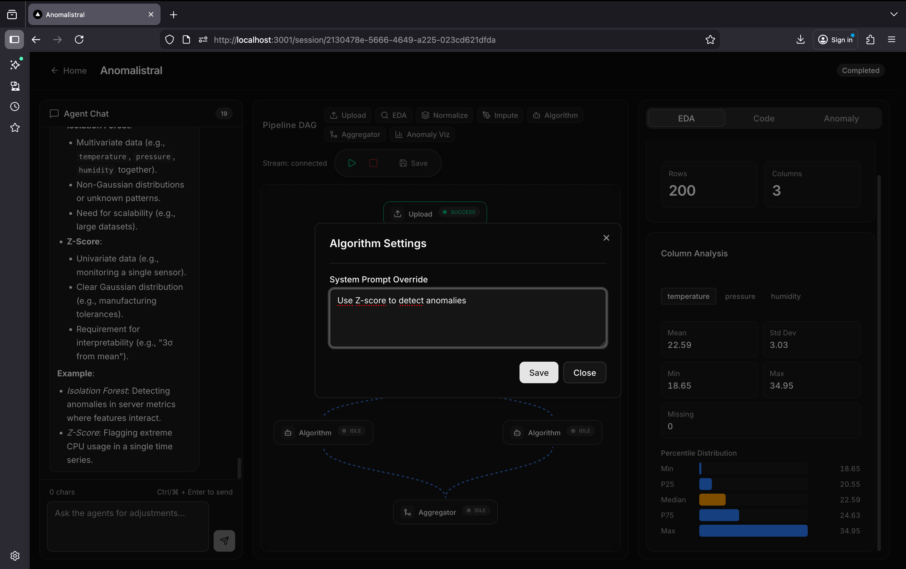

<p align="center">
  <h1 align="center">🌌 Anomalistral</h1>
  <p align="center"><strong>Autonomous Agentic MLOps Platform for Time-Series Anomaly Detection</strong></p>
</p>

<p align="center">
  <a href="https://mistral.ai"></a>
  <a href="https://opensource.org/licenses/MIT"></a>
  <a href="https://nextjs.org/"></a>
  <a href="https://fastapi.tiangolo.com/"></a>
  <a href="https://reactflow.dev/"></a>
</p>

<p align="center">
  <em>Transform natural language descriptions into production-ready anomaly detection pipelines — zero ML expertise required.</em>
</p>

---

Anomalistral orchestrates specialized Mistral AI agents through a visual **DAG (Directed Acyclic Graph) workbench** to automate the entire anomaly detection lifecycle: data ingestion, exploratory analysis, preprocessing, algorithm execution, ensemble aggregation, and anomaly visualization. Users design pipelines by connecting modular blocks on an interactive canvas, configure each block's parameters, and launch execution — the platform handles everything else autonomously.

Built in **48 hours** for the **Mistral AI Hackathon 2026**.

---

## 📸 Screenshots

### Default Pipeline — Basic Anomaly Detection
> A complete linear anomaly detection workflow (Upload → EDA → Normalization → Algorithm → Anomaly Visualization). The image shows the real-time execution in progress with live status badges.



### Chat Panel + EDA Results
> The Orchestrator chat on the left guides the user through the process, while the right panel displays comprehensive statistical analysis and data distributions extracted by the EDA agent.



### Code Tab — Generated Python Code
> The exact, production-ready Python script autonomously generated and executed by the Mistral code-interpreter agent, complete with syntax highlighting and available for download.



### Anomalies Tab — Detected Anomalies
> A detailed data table presenting the detected anomaly rows seamlessly enriched with the original dataset's context and columns for easy review.



### Node Interactions — Block Edition & Deletion
> Hovering over a DAG node reveals intuitive quick-action buttons for configuration and removal, making pipeline restructuring effortless.



### Multi-Algorithm Ensemble Pipeline
> A complex DAG architecture where multiple anomaly detection algorithms run concurrently in parallel, feeding their independent results into an Aggregator block for a combined consensus.



### Block Configuration — Aggregator
> The ensemble configuration interface where users can define the aggregation strategy (e.g., weighted average) and assign custom influence weights to each input algorithm.



### Block Configuration — Algorithm
> Advanced settings for the Algorithm block, empowering users to override the default instructions and explicitly steer the Mistral agent's detection logic using natural language prompts.



---

## ✨ Key Features

| Feature | Description |
| :--- | :--- |
| **Visual DAG Editor** | Drag-and-drop pipeline builder using React Flow 12 with custom status-aware nodes, animated edges, and a mini-map |
| **7 Block Types** | Upload, EDA, Normalization, Imputation, Algorithm, Aggregator, Anomaly Visualization — each with its own configurable parameters |
| **AI-Powered Execution** | EDA and Algorithm blocks are executed by dedicated Mistral agents with `code_interpreter` running real Python code in a sandboxed environment |
| **Multi-Algorithm Ensemble** | Run multiple anomaly detection algorithms in parallel and merge results via configurable Aggregator blocks (majority vote or weighted average) |
| **Real-Time Streaming** | SSE-powered live updates — every block status change, pipeline event, and chat message streams to the UI instantly |
| **Orchestrator Chat** | Natural language conversation with a Mistral-powered orchestrator agent that describes the pipeline, answers questions, and provides context |
| **Per-Block Chat** | Interact with individual block agents directly to ask questions about their specific results |
| **Pipeline Templates** | Pre-built pipeline configurations (Basic Anomaly Detection, Multi-Algorithm Ensemble) that can be applied with one click |
| **Data Preprocessing** | Built-in normalization (min-max, standard scaler, robust) and imputation (median, mean, mode, forward fill) applied locally via Pandas |
| **Production-Ready Code** | Algorithm blocks generate and display the actual Python code they execute, available for download |
| **Anomaly Results Table** | Detected anomalies are enriched with original data columns and displayed in a sortable table |

---

## 🏗️ Architecture

Anomalistral follows a **DAG-based agentic architecture** where each pipeline block can optionally delegate its work to a dedicated Mistral AI agent.


### How It Works

1. **Session Creation** — User provides a natural language description of their anomaly detection goal and uploads a CSV dataset.

2. **Pipeline Design** — User selects a pre-built template or manually constructs a DAG by dragging blocks onto the canvas and connecting them with edges.

3. **Configuration** — Each block can be configured:
   - **Upload**: Select which columns to include in analysis
   - **Normalization**: Choose method (`min_max`, `standard_scaler`, `robust`) and target columns
   - **Imputation**: Choose method (`median`, `mean`, `mode`, `forward_fill`) and target columns
   - **Algorithm**: Override the default prompt to guide the AI agent (e.g., "Use Isolation Forest with contamination=0.05")
   - **Aggregator**: Set aggregation method (`majority_vote`, `weighted_average`) and per-source weights

4. **Execution** — The DAG Executor performs a topological sort to determine execution order, then runs blocks layer by layer:
   - Blocks within the same layer execute **in parallel** via `asyncio.gather`
   - **Agent-backed blocks** (EDA, Algorithm) upload the dataset to Mistral's Files API and call `conversations.start` with a `ToolFileChunk` attachment, enabling the agent to run Python code directly on the data
   - **Local blocks** (Normalization, Imputation, Aggregator) process data directly using Pandas
   - Every status change broadcasts an SSE event to all connected clients

5. **Results** — Results populate in real-time across multiple tabs:
   - **EDA**: Statistical summary, column types, null counts, data quality flags
   - **Code**: The exact Python code executed by the Algorithm agent (with syntax highlighting via Shiki)
   - **Anomalies**: Detected anomaly rows enriched with original data columns
   - **Chat**: Ongoing conversation with the orchestrator agent

### Key Technical Decisions

- **`conversations.start` for all agent execution** — Not `agents.complete` which returns tool_call intent without executing code
- **Sparse `anomaly_indices` instead of full score arrays** — Requesting only indices of anomalous rows prevents LLM token truncation on large datasets
- **Per-subscriber SSE broadcast queues** — Each connected client gets its own `asyncio.Queue` to prevent event-stealing between multiple browser tabs
- **Decoupled SSE generators from async DB sessions** — Events are fetched before entering the SSE generator to prevent `CancelledError` on client disconnect from tearing down the `aiosqlite` connection pool
- **Dataset uploaded once, reused across blocks** — The Mistral `file_id` is cached on the session after the first upload

---

## 🧱 DAG Block Types

| Block | Category | AI Agent | I/O Types | Configurable Parameters |
| :--- | :--- | :---: | :--- | :--- |
| **Upload** | Data Input | ❌ | → `dataframe` | Column selection |
| **EDA** | Analysis | ✅ `code_interpreter` | `dataframe` → `eda_report` | — |
| **Normalization** | Processing | ❌ | `dataframe` → `dataframe` | Method: `min_max` · `standard_scaler` · `robust` · `standardize`; Column selection |
| **Imputation** | Processing | ❌ | `dataframe` → `dataframe` | Method: `median` · `mean` · `mode` · `forward_fill`; Column selection |
| **Algorithm** | Detection | ✅ `code_interpreter` | `dataframe` + `eda_report` → `anomaly_scores` | Custom prompt override |
| **Aggregator** | Ensemble | ❌ | `anomaly_scores` → `anomaly_scores` | Method: `majority_vote` · `weighted_average`; Per-source weights |
| **Anomaly Viz** | Visualization | ❌ | `anomaly_scores` + `dataframe` → — | — |

The DAG executor enforces **type compatibility** between connected blocks — edges are validated to ensure output types from the source node match the required input types of the target node. Cyclic dependency detection runs before every execution.

---

## 💻 Tech Stack

| Layer | Technology | Purpose |
| :--- | :--- | :--- |
| **AI Core** | Mistral Agents API (`mistral-large-latest`) | Agent creation, `conversations.start`, `code_interpreter` sandbox |
| **AI Integration** | Mistral Files API | Dataset upload with `purpose="code_interpreter"`, `ToolFileChunk` attachment |
| **Backend Framework** | FastAPI | Async REST API with dependency injection |
| **Database** | SQLAlchemy 2.0 + aiosqlite (Async SQLite) | Sessions, blocks, edges, events, templates, messages |
| **Data Processing** | Pandas, NumPy | Local normalization, imputation, anomaly enrichment |
| **Data Validation** | Pandera | Schema validation for uploaded datasets |
| **Streaming** | sse-starlette | Server-Sent Events with per-subscriber broadcast |
| **Retry Logic** | Custom `retry_sync` wrapper | Exponential backoff for Mistral API rate limits |
| **Frontend Framework** | Next.js 15 (App Router) + React 19 | SSR-ready SPA with file-based routing |
| **DAG Editor** | React Flow 12 (`@xyflow/react`) | Interactive node-edge canvas with custom nodes |
| **State Management** | Zustand 5 | Three stores: session, pipeline, stream |
| **UI Components** | shadcn/ui + Radix UI | Accessible, composable component primitives |
| **Styling** | Tailwind CSS 4 | Utility-first CSS with dark mode support |
| **Syntax Highlighting** | Shiki 4 (dynamic import) | WASM-based code highlighting for generated Python |
| **Markdown Rendering** | react-markdown + remark-gfm | Chat message formatting with GFM support |
| **SSE Client** | @microsoft/fetch-event-source | Robust EventSource with reconnection and auth headers |
| **Icons** | Lucide React | Consistent iconography across the UI |
| **Deployment** | Docker (multi-stage), Vercel, Railway | Production-ready containerization and hosting |

---

## 📂 Project Structure

```
anomalistral/
├── backend/
│   ├── app/
│   │   ├── agents/
│   │   │   ├── dag_executor.py        # DAG topological sort, block execution, Mistral integration
│   │   │   ├── registry.py            # Agent creation & caching (AgentRegistry)
│   │   │   └── prompts/
│   │   │       ├── algorithm.py       # Algorithm agent system prompt
│   │   │       ├── codegen.py         # Code generation agent prompt
│   │   │       ├── eda.py             # EDA agent system prompt (strict JSON output)
│   │   │       └── orchestrator.py    # Orchestrator chat agent prompt
│   │   ├── db/
│   │   │   ├── seed.py                # Block definitions + pipeline templates seeder
│   │   │   └── session.py             # Async SQLite engine & session factory
│   │   ├── models/
│   │   │   ├── database.py            # SQLAlchemy ORM models (Session, SessionBlock, Event, ...)
│   │   │   └── schemas.py             # Pydantic request/response schemas
│   │   ├── routers/
│   │   │   ├── dag.py                 # DAG CRUD, block/edge management, pipeline control
│   │   │   ├── pipelines.py           # Legacy pipeline start endpoint
│   │   │   ├── sessions.py            # Session lifecycle, chat commands
│   │   │   ├── stream.py              # SSE event streaming endpoint
│   │   │   ├── templates.py           # Pipeline template listing
│   │   │   └── uploads.py             # File upload (CSV/JSON)
│   │   ├── services/
│   │   │   ├── file_handler.py        # Upload storage & validation
│   │   │   ├── retry.py               # Exponential backoff wrapper for Mistral SDK
│   │   │   └── streaming.py           # StreamManager (pub/sub SSE broadcast)
│   │   ├── config.py                  # Pydantic Settings (env-based configuration)
│   │   ├── deps.py                    # FastAPI dependency providers
│   │   └── main.py                    # App entrypoint (lifespan, CORS, routers)
│   ├── .env.example
│   ├── Dockerfile                     # Multi-stage Python 3.12 build
│   ├── railway.toml                   # Railway deployment config
│   └── requirements.txt
│
├── frontend/
│   ├── src/
│   │   ├── app/
│   │   │   ├── layout.tsx             # Root layout with ThemeProvider
│   │   │   ├── page.tsx               # Landing page (session creation)
│   │   │   └── session/[id]/
│   │   │       └── page.tsx           # Main workspace (DAG + Chat + Results)
│   │   ├── components/
│   │   │   ├── chat/
│   │   │   │   ├── BlockChat.tsx      # Per-block agent chat interface
│   │   │   │   └── ChatPanel.tsx      # Orchestrator chat with markdown rendering
│   │   │   ├── pipeline/
│   │   │   │   ├── BlockSettings.tsx   # Dynamic block configuration dialog
│   │   │   │   ├── DAGToolbar.tsx      # Run/Stop/Rerun pipeline controls
│   │   │   │   ├── PipelineEditor.tsx  # React Flow canvas with drag-and-drop
│   │   │   │   ├── PipelineNode.tsx    # Custom DAG node with status indicators
│   │   │   │   └── TemplateSelector.tsx# Template picker dropdown
│   │   │   ├── results/
│   │   │   │   ├── AnomalyChart.tsx   # Anomaly results data table
│   │   │   │   ├── CodeViewer.tsx     # Multi-tab code display with Shiki
│   │   │   │   └── EDAReport.tsx      # Statistical analysis visualization
│   │   │   ├── error/                 # ErrorBoundary, PanelError
│   │   │   ├── layout/                # Header component
│   │   │   ├── loading/               # Skeleton loaders (Session, Pipeline, Results)
│   │   │   ├── providers/             # ThemeProvider (next-themes)
│   │   │   └── ui/                    # shadcn/ui primitives
│   │   ├── hooks/
│   │   │   ├── useSSE.ts             # SSE connection manager with reconnection
│   │   │   └── useSession.ts         # Session data fetching & hydration
│   │   ├── stores/
│   │   │   ├── pipelineStore.ts      # DAG nodes/edges state (React Flow sync)
│   │   │   ├── sessionStore.ts       # Session data, messages, loading states
│   │   │   └── streamStore.ts        # SSE connection status, event buffer
│   │   ├── lib/
│   │   │   ├── api.ts                # Typed API client (fetch wrapper)
│   │   │   └── utils.ts              # Tailwind merge utility
│   │   └── types/
│   │       └── index.ts              # Shared TypeScript definitions
│   ├── vercel.json                    # Vercel deployment config
│   ├── next.config.ts
│   └── package.json
│
├── sample_data*.csv                   # Example datasets for testing
└── README.md
```

---

## 📋 API Reference

### Sessions

| Method | Endpoint | Description |
| :--- | :--- | :--- |
| `POST` | `/api/sessions` | Create a new analysis session |
| `GET` | `/api/sessions/{id}` | Get session details (status, results, config) |
| `POST` | `/api/sessions/{id}/command` | Send a command: `chat`, `cancel`, `modify`, `approve` |
| `POST` | `/api/sessions/{id}/recover` | Mark a stuck session as failed |
| `GET` | `/api/sessions/{id}/artifacts` | List generated filesystem artifacts |

### DAG & Blocks

| Method | Endpoint | Description |
| :--- | :--- | :--- |
| `GET` | `/api/sessions/{id}/dag` | Load the full DAG (nodes + edges) |
| `PUT` | `/api/sessions/{id}/dag` | Save/overwrite the entire DAG definition |
| `POST` | `/api/sessions/{id}/dag/validate` | Validate DAG for cycles and type mismatches |
| `POST` | `/api/sessions/{id}/blocks` | Add a new block to the DAG |
| `PUT` | `/api/sessions/{id}/blocks/{block_id}` | Update block configuration |
| `DELETE` | `/api/sessions/{id}/blocks/{block_id}` | Remove a block |
| `POST` | `/api/sessions/{id}/edges` | Connect two blocks with an edge |
| `DELETE` | `/api/sessions/{id}/edges/{edge_id}` | Remove an edge |
| `GET` | `/api/sessions/{id}/blocks/{block_id}/messages` | Get block-level chat history |
| `POST` | `/api/sessions/{id}/blocks/{block_id}/chat` | Send a message to a block's agent |

### Pipeline Control

| Method | Endpoint | Description |
| :--- | :--- | :--- |
| `POST` | `/api/sessions/{id}/pipeline/control` | Control pipeline: `run`, `stop`, `pause`, `rerun`, `continue_from` |
| `POST` | `/api/sessions/{id}/apply-template` | Apply a pre-built pipeline template to the session |

### Templates & Uploads

| Method | Endpoint | Description |
| :--- | :--- | :--- |
| `GET` | `/api/templates` | List all available pipeline templates |
| `GET` | `/api/templates/{id}` | Get a specific template definition |
| `POST` | `/api/uploads` | Upload a CSV or JSON dataset |

### Streaming

| Method | Endpoint | Description |
| :--- | :--- | :--- |
| `GET` | `/api/stream/{id}` | SSE event stream (replays full history on connect) |

### SSE Event Types

```
pipeline.started    pipeline.completed    pipeline.failed    pipeline.cancelled
block.started       block.completed       block.failed       block.status
block.agent.message
chat.response
command.chat        command.cancel        command.modify      command.approve
dag.validated
```

---

## 🚀 Getting Started

### Prerequisites

- **Python** 3.10+
- **Node.js** 20+
- **Mistral API Key** — obtain from [console.mistral.ai](https://console.mistral.ai)

### Backend

```bash
cd backend
python -m venv venv
source venv/bin/activate   # Windows: venv\Scripts\activate
pip install -r requirements.txt

cp .env.example .env
# Edit .env and add your MISTRAL_API_KEY

uvicorn app.main:app --reload --port 8000
```

The backend automatically seeds the database with block definitions and pipeline templates on first startup.

### Frontend

```bash
cd frontend
npm install

cp .env.example .env.local
# Set NEXT_PUBLIC_API_URL=http://localhost:8000

npm run dev
```

Open [http://localhost:3000](http://localhost:3000) to access the Anomalistral workbench.

### Environment Variables

#### Backend (`.env`)

| Variable | Default | Description |
| :--- | :--- | :--- |
| `MISTRAL_API_KEY` | *(required)* | Your Mistral API key |
| `MISTRAL_DEFAULT_MODEL` | `mistral-large-latest` | Model for all agents |
| `DATABASE_URL` | `sqlite+aiosqlite:///./anomalistral.db` | Async SQLite connection string |
| `UPLOAD_DIR` | `./uploads` | Directory for uploaded datasets |
| `CORS_ORIGINS` | `http://localhost:3000` | Comma-separated allowed origins |

#### Frontend (`.env.local`)

| Variable | Description |
| :--- | :--- |
| `NEXT_PUBLIC_API_URL` | Backend API base URL (e.g., `http://localhost:8000`) |

---

## 🐳 Deployment

### Docker (Backend)

```bash
cd backend
docker build -t anomalistral-backend .
docker run -p 8000:8000 -e MISTRAL_API_KEY=your_key anomalistral-backend
```

The multi-stage Dockerfile uses `python:3.12-slim`, installs dependencies, and runs Uvicorn on port 8000.

### Vercel (Frontend)

The frontend includes a `vercel.json` configuration and is optimized for Vercel deployment with automatic edge routing.

### Railway (Backend)

The backend includes a `railway.toml` for one-click Railway deployment.

---

## 🧪 Pipeline Templates

### Basic Anomaly Detection

A simple linear pipeline for straightforward anomaly detection tasks:

```
Upload → EDA → Normalization → Algorithm → Anomaly Visualization
```

- Default normalization: `min_max`
- Default algorithm prompt: "Use Isolation Forest to detect anomalies"

### Multi-Algorithm Ensemble

A parallel pipeline that runs three independent algorithm blocks and merges their results:

```
Upload → EDA → Normalization → ┬─ Algorithm 1 ─┬→ Aggregator → Anomaly Visualization
                                ├─ Algorithm 2 ─┤
                                └─ Algorithm 3 ─┘
```

- Default aggregation: `majority_vote`
- Each algorithm block can be configured with a different prompt to use different detection methods

---

## 🏆 Mistral AI Hackathon 2026

Built within **48 hours** for the [Mistral AI Hackathon 2026](https://mistral.ai), showcasing the power of the **Mistral Agents API** with:
- `client.beta.agents.create` — Per-block agent creation with specialized system prompts
- `conversations.start` — Autonomous execution with `code_interpreter` running real Python code
- `client.files.upload` — Dataset injection via `ToolFileChunk` for direct sandbox access
- `conversations.append` — Multi-turn chat with persistent conversation context

Anomalistral demonstrates how autonomous AI agents can bridge the gap between complex ML engineering and **zero-code accessibility** — enabling anyone to build, customize, and execute anomaly detection pipelines through an intuitive visual interface.

---

## 👥 Team

**KR Agents Team**

- [Kacper Kozik](https://github.com/Kacper0199)
- [Kamil Bednarz](https://github.com/kambedn)

---

<p align="center">
  <sub>Built with ❤️ using Mistral AI · Next.js · FastAPI · React Flow</sub>
</p>
