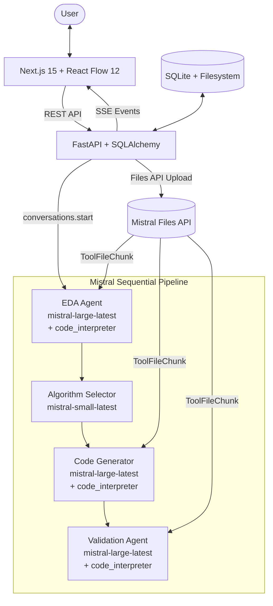

# 🌌 Anomalistral

[](https://mistral.ai)
[](https://opensource.org/licenses/MIT)
[](https://nextjs.org/)
[](https://fastapi.tiangolo.com/)

**Autonomous Agentic MLOps Platform for Time-Series Anomaly Detection.**

Anomalistral transforms natural language descriptions into production-ready anomaly detection pipelines. By orchestrating five specialized Mistral agents through a sequential execution pipeline, the platform automates data ingestion, exploratory analysis, algorithm selection, code generation, and statistical validation—all visualized through an interactive DAG editor.

---

## 🛠️ Architecture

Anomalistral uses a **sequential agent pipeline** powered by the **Mistral Agents API**. Each pipeline phase runs as an independent `conversations.start` call with dataset files uploaded to the Mistral sandbox via the **Files API** and attached as `ToolFileChunk` entries. The frontend synchronizes with the backend via **Server-Sent Events (SSE)** for real-time progress updates.



**Key implementation details:**
- Datasets are uploaded to Mistral via `client.files.upload(purpose="code_interpreter")` and attached to agent inputs as `ToolFileChunk` content chunks
- Each agent phase is an independent `conversations.start` call (no server-side handoffs)
- The EDA phase's `conversation_id` is preserved for follow-up chat interactions
- All agents with `code_interpreter` execute code in Mistral's sandboxed environment

---

## ✨ Features

- **Natural Language Orchestration**: Describe your data and detection goals; the pipeline handles the rest.
- **Interactive DAG Editor**: Visualize the generated MLOps pipeline using React Flow 12 with status-aware custom nodes.
- **Automated EDA**: Deep statistical analysis, distribution profiling, and data quality scoring via Mistral code_interpreter.
- **Intelligent Model Selection**: Algorithm recommendations (Isolation Forest, Local Outlier Factor, etc.) tailored to data characteristics.
- **Production-Ready Code**: Instant generation of clean Python code using Mistral Large with code_interpreter for in-sandbox testing.
- **Rigorous Validation**: Statistical performance metrics and automated validation reports for reliability assurance.
- **Real-time Streaming**: SSE-powered UI that reflects agent progress and pipeline execution status instantly.
- **Sandbox File Access**: Datasets uploaded via Mistral Files API and attached as `ToolFileChunk` for direct sandbox access.

---

## 💻 Tech Stack

| Component | Technology |
| :--- | :--- |
| **LLM Core** | Mistral Agents API (`mistral-large-latest`, `mistral-small-latest`), Code Interpreter, Files API |
| **Frontend** | Next.js 15 (App Router), React 19, Tailwind CSS 4, shadcn/ui |
| **State & Flow** | React Flow 12, Zustand |
| **Visuals** | Recharts (Time-series), Shiki (Syntax highlighting) |
| **Backend** | FastAPI, sse-starlette, SQLAlchemy (Async), SQLite |
| **Data Ops** | Pandera (Validation), Pandas, NumPy |
| **DevOps** | Docker (Multi-stage), Vercel, Railway |

---

## 🚀 Getting Started

### Prerequisites
- Python 3.10+
- Node.js 20+
- Mistral API Key

### Backend Setup
```bash
cd backend
python -m venv venv
source venv/bin/activate
pip install -r requirements.txt
cp .env.example .env
uvicorn app.main:app --reload
```

### Frontend Setup
```bash
cd frontend
npm install
cp .env.example .env.local
npm run dev
```

---

## 📂 Project Structure

```text
.
├── backend/
│   ├── app/
│   │   ├── agents/
│   │   │   ├── prompts/       (orchestrator, eda, algorithm, codegen, validation)
│   │   │   ├── executor.py    (sequential pipeline + Mistral Files API upload)
│   │   │   └── registry.py    (agent creation & caching)
│   │   ├── db/                (async SQLite session factory)
│   │   ├── models/            (SQLAlchemy models + Pydantic schemas)
│   │   ├── routers/           (sessions, pipelines, uploads, stream)
│   │   ├── services/          (streaming, file_handler, retry)
│   │   ├── config.py
│   │   ├── deps.py
│   │   └── main.py
│   ├── Dockerfile
│   ├── railway.toml
│   └── requirements.txt
├── frontend/
│   ├── src/
│   │   ├── app/               (landing page, session workspace, 404)
│   │   ├── components/
│   │   │   ├── chat/          (ChatPanel)
│   │   │   ├── error/         (ErrorBoundary, PanelError)
│   │   │   ├── layout/        (Header)
│   │   │   ├── loading/       (SessionSkeleton, PipelineSkeleton, ResultsSkeleton)
│   │   │   ├── pipeline/      (PipelineEditor, PipelineNode)
│   │   │   ├── providers/     (ThemeProvider)
│   │   │   ├── results/       (EDAReport, CodeViewer, ValidationReport, AnomalyChart)
│   │   │   └── ui/            (shadcn/ui components)
│   │   ├── hooks/             (useSSE, useSession)
│   │   ├── stores/            (pipelineStore, sessionStore, streamStore)
│   │   ├── lib/               (api client, utils)
│   │   └── types/
│   ├── vercel.json
│   └── package.json
├── ANOMALISTRAL_PLAN.md
├── DEMO.md
└── README.md
```

---

## 📋 API Reference

| Endpoint | Method | Description |
| :--- | :--- | :--- |
| `/api/sessions` | `POST` | Initialize a new analysis session |
| `/api/sessions/:id/command` | `POST` | Dispatch natural language commands to agents |
| `/api/pipelines/:id/start` | `POST` | Trigger the full autonomous pipeline |
| `/api/uploads` | `POST` | Ingest CSV/Parquet time-series data |
| `/api/stream/:id` | `GET` | Connect to the SSE event stream |
| `/api/health` | `GET` | System health check |

---

## 🚢 Deployment

The project is architected for cloud-native deployment:
- **Frontend**: Optimized for Vercel with edge-ready configuration.
- **Backend**: Multi-stage Dockerfile ready for Railway or Render.
- **Resilience**: Implements exponential backoff on all Mistral API calls to respect rate limits.

---

## 🏆 Mistral Hackathon 2026

Built within 48 hours for the Mistral Hackathon, showcasing the power of the **Mistral Agents API** with `conversations.start`, `code_interpreter`, and the **Files API**. Anomalistral demonstrates how autonomous agents can bridge the gap between complex ML requirements and zero-code accessibility.

**Team:** KR Agents Team — [Kacper Kozik](https://github.com/Kacper0199), [Kamil Bednarz](https://github.com/kambedn)
